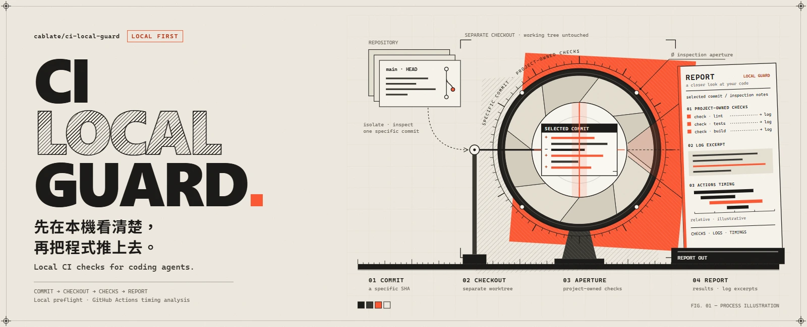

# CI Local Guard
[English](README.md)



**讓寫程式的 AI 在 push 前先檢查一次，也幫你找出 CI 到底慢在哪裡。**

AI 改完程式、推上去，CI 才告訴你測試沒過。你把日誌貼回去，AI 再改一次，然後又等一輪。

CI Local Guard 就是想縮短這個來回。它用專案原本的檢查指令，先測一次你準備提交的版本，再把結果整理給 AI：跑了什麼、哪裡失敗、日誌在哪裡、還有什麼沒檢查。

它也能讀取 GitHub Actions 的執行時間，讓你和 AI 一起找出慢的步驟，並比較調整前後的差別。

## 它能幫你做什麼？

- **push 前先檢查。** 在獨立目錄裡，用既有測試腳本檢查指定的 commit，不混入手上還沒完成的修改。
- **讓 AI 比較好處理失敗。** 給它精簡的 JSON 報告和相關日誌片段，不必整份貼進對話。
- **找出 CI 慢在哪裡。** 查看各項工作、各個步驟的耗時，再比較修改前後的執行結果。

Guard 和原本的 CI 搭配使用：能在本機跑的檢查先跑，需要雲端環境的部分仍交給 GitHub Actions。

## 直接請你的 AI 幫你接入

把這個 repo 連結交給 AI，像這樣說就可以：

> 幫我的專案接入 https://github.com/cablate/ci-local-guard 。先讀它的 README 和接入指南，看看我現有的 CI 與測試指令，再把 Guard 接到這些檢查上。告訴我平常改程式、push 前，以及想改善 CI 速度時該怎麼用。

你的 AI 需要能讀取專案檔案、執行 Node 指令。下面的 [AI 操作入口](#ai-操作入口)有接入流程，不用另外重寫一套測試。

## 安裝 CLI

需要 Node 22（>=22.13.0 <23）和 Git。找一個獨立目錄下載工具：

```sh
git clone --branch v0.1.1 --depth 1 https://github.com/cablate/ci-local-guard.git
node ci-local-guard/cli.mjs --version
node ci-local-guard/cli.mjs --help
```

版本指令應顯示 0.1.1。裝好一份，就能給多個專案使用。

不需要 npm 帳號，也可以從 [GitHub Releases](https://github.com/cablate/ci-local-guard/releases) 下載。這個工具目前透過 GitHub 提供，沒有發布到 npm registry。

想先試一下、不急著接入專案？可以照[離線範例](docs/reference.zh-TW.md#離線示範)分析一份小型示範資料。

### 你用的是 Claude Code？

也可以安裝選用的 plugin：

```sh
claude plugin marketplace add cablate/ci-local-guard
claude plugin install ci-local-guard@ci-local-guard-marketplace
```

重新啟動 Claude Code，輸入 /ci-local-guard:ci。plugin 內含同一套 CLI，以及給 Claude 的使用指引；仍需要 Node 和 Git。

## AI 操作入口

接入前先讀[接入指南與指令參考](docs/reference.zh-TW.md)。一般流程是：

1. **先看懂專案。** 確認目前的 repo、分支、尚未完成的修改，以及既有測試指令。
2. **接上原本的檢查。** 在專案裡放一個小腳本，呼叫既有指令並回報結果。這個腳本叫 adapter；.ci-local-guard.json 負責告訴 Guard 去哪裡找它。
3. **檢查對的版本。** 改程式時照常跑專案的針對性測試；push 前，再用 Guard 檢查指定 commit，並明確指定比較的基準。
4. **看結果，處理問題。** 告訴使用者哪些通過、哪些失敗、哪些還沒驗證。需要查錯時，從報告提供的位置讀日誌。

先檢查專案是否已經設定好：

```sh
node "<tool-directory>/cli.mjs" doctor --check --repo "<consumer-path>" --summary
```

這一步只讀設定，不會執行專案測試。adapter 提交後，就能檢查指定版本：

```sh
node "<tool-directory>/cli.mjs" preflight --repo "<consumer-path>" --base <base> --head <commit> --summary --output <new-report.json>
```

把佔位符換成實際路徑與 commit。報告目錄要先存在，檔名請用新的。--summary 給 AI 精簡 JSON，--output 則保留完整報告。

如果結果是 incomplete，意思是還有不在這次本機檢查範圍裡的工作，例如只在 CI 跑的瀏覽器測試。各種結果怎麼處理，見[結果說明](docs/reference.zh-TW.md)。

## 推送前抓出 CI 失敗（開發版）

v0.1.1 尚未包含。這些命令不需要 adapter，直接讀取你的 GitHub workflows。重播 job 需要 [act](https://github.com/nektos/act) 0.2.89，以及能跑 Linux 容器的 Docker。

```sh
node "<tool-directory>/cli.mjs" ci discover --repo "<project>" --summary
node "<tool-directory>/cli.mjs" ci verify --repo "<project>" --summary
node "<tool-directory>/cli.mjs" ci locate --repo "<project>" --summary
node "<tool-directory>/cli.mjs" ci diff --repo "<project>" --summary
```

discover 告訴 AI：CI 會跑哪些命令、哪些 job 能在本機跑、哪些只有 GitHub 能檢查。verify 拿你準備推送的 commit，判斷它會觸發哪些 workflows，再在本機容器跑 Linux jobs。它會回報預期失敗的部分（附失敗的 step、命令與 log 位置），以及仍需 GitHub 驗證的部分，例如 Windows job 或用到 secrets 的 job。如果 GitHub 上的 run 仍然失敗，locate 會找出 HEAD commit 的 runs，指出失敗的 job、step 與測試（附檔案與行號），並把該 step 的 log 存在本機，讓 AI 只讀需要的部分。修改 workflow 後，diff 會告訴你：同樣的變更下，CI 是否檢查得比較少，例如少了 matrix leg、篩選變窄或刪了命令。細節見[參考手冊](docs/reference.zh-TW.md#看懂檢查與重播-ci未發布)。

## 想知道 CI 為什麼慢？

這部分不用先設定 adapter。只要 GitHub CLI（gh）已登入：

```sh
node "<tool-directory>/cli.mjs" collect-runs --repository owner/repo --workflow ci.yml > runs.json
node "<tool-directory>/cli.mjs" inspect-runs --input runs.json
node "<tool-directory>/cli.mjs" audit-runs --input runs.json
```

這幾個指令會收集執行紀錄，整理時間花在哪裡。AI 可以據此追查慢的步驟、提出修改，再用 compare-runs 比較前後結果。目的是少做重複、沒必要的工作，不是少跑該跑的測試。

## 更多說明

- [接入、報告格式與範例](docs/reference.zh-TW.md)
- [更新與移除](docs/reference.zh-TW.md#更新停用與移除)
- [設定與疑難排解](docs/reference.zh-TW.md#資料權限與設定)
- [版本變更](CHANGELOG.zh-TW.md) · [參與開發](https://github.com/cablate/ci-local-guard/blob/main/CONTRIBUTING.md) · [MIT 授權](LICENSE)

Guard 會用你的本機權限執行專案腳本，請用在你信任的專案上。工具本身沒有遙測；分享日誌前，記得檢查有沒有私人資料。安全問題可以[私下回報](https://github.com/cablate/ci-local-guard/security/advisories/new)。

<details>
<summary>PRINCIPLE：我們怎麼決定這工具該做什麼</summary>

1. 同時幫助本機開發與 CI，不只是把工作搬來搬去。
2. 改善速度時，保留真正保護專案的檢查。
3. 沿用專案的規則，不另養一套。
4. 檢查準備提交的版本，和未完成的修改分開。
5. 先減少重複、沒必要的工作，再考慮快取或平行處理。
6. 輸入確實相同，結果才值得重用；目前 Guard 每次都重新檢查。
7. 分開看等待時間和工作總耗時，不直接拿來當帳單。
8. 失敗要有用：說清楚跑了什麼、哪裡沒過、去哪裡查。
9. 分開調查、提案與修改，需要授權的操作先確認。
10. 工具保持小而好維護，依真實需求增加功能，不預造整合層。

</details>

## 目前進度

[v0.1.1](https://github.com/cablate/ci-local-guard/releases/tag/v0.1.1) 是實驗版。[Windows 與 Ubuntu 測試](https://github.com/cablate/ci-local-guard/actions/runs/37725011025)已通過，也實測了發布壓縮檔，以及 Claude Code 2.1.293 plugin 的安裝、更新和移除。macOS、arm64、Claude Desktop、WSL 尚未測試。

我們也用 Guard 檢查這個 repo。尚未發布的開發版原始碼加入了推送前檢查：ci discover、ci check、ci replay、ci verify，量測失敗與慢 job 代價的 ci history，定位 GitHub 失敗 run 的 ci locate，以及檢查 workflow 修改的 ci diff。目前在 Windows 搭配 Docker Desktop（Linux 容器）上實測過。v0.1.1 尚未包含這些命令。

哪裡看不懂或用不起來？歡迎[開 issue](https://github.com/cablate/ci-local-guard/issues)，附上工具版本、作業系統和簡單的重現例子。
